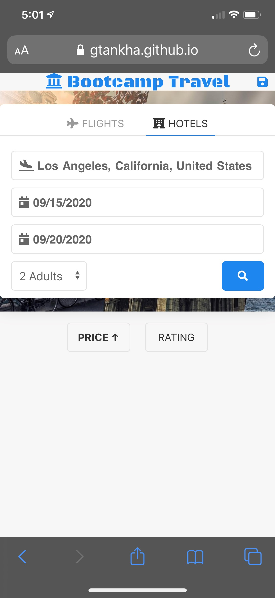
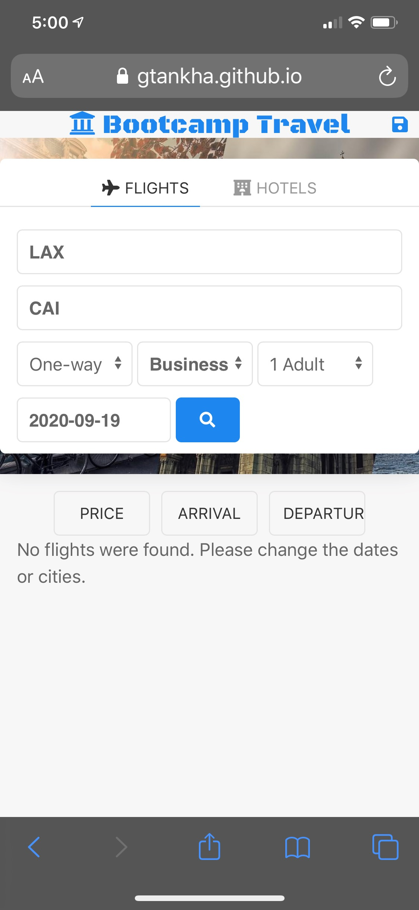
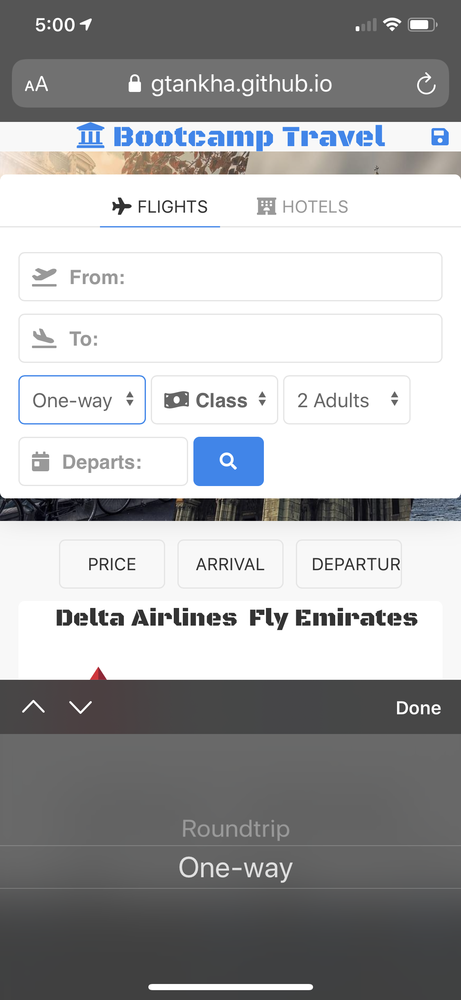
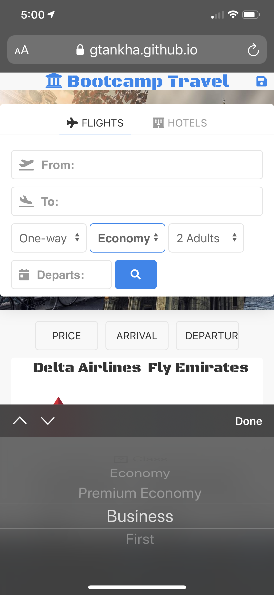

# BootCamp Travel

**Bootcamp Travel** is group 7's project 1 at the University of California, Berkeley, extension, blended-online full-stack web-development part-time bootcamp.

## Wiki

Link: https://github.com/gtankha/bootcamptravel/wiki

## Purpose of App

- As a frequent traveler...
- I want to be able to:
  - get quick quotes for airfare and lodging costs
  - and save my favorite results
- So that I can:
  - budget for my trip more accurately
  - and access my favorites list in the future

## Collaborators (Group Members)

| Name              | GitHub Page                     | Main Role                            | Files                                    |
| ----------------- | ------------------------------- | ------------------------------------ | ---------------------------------------- |
| Gautam Tankha     | https://github.com/gtankha      | Project Manager & Hotel search       | `hotel.js`                               |
| Marco Evangelista | https://github.com/marcobjj     | User Interface (Structure & Styling) | `index.html`, `style.css`, & `script.js` |
| Ahmad El Gamal    | https://github.com/ahmadelgamal | Flights search                       | `flights.js`                             |

## Technologies Used

1. HTML5
2. CSS3
3. JavaScript ES6
4. JSON
5. AJAX
6. jQuery
7. UI Kit (CSS Framework)
8. Node.js
9. Express.js
10. Heroku

## Heroku Deployment URL

https://bootcamp-travel.herokuapp.com/

## GitHub Repo URL

https://github.com/gtankha/bootcamptravel/

## How to Use the App

This app is very simple to use. Just follow these steps:

- Fill up the search-form (either hotels or flights)
- Hit enter or click the search button
- You may sort the results as follows:
  - For hotels: by price or ratings
  - For flights: by price, departure time, or arrival time
- Scroll through the list of search results
- Pick your favorite hotel or flight
- Click on the favorite icon to save it to memory (you may choose up to 5 flights and/or 5 hotels)
- Revisit the website at any time to see your favorite items, or make new searches!

## Pre-requisites

Flights section cannot run without a valid _access token_ from **Amadeus**. To receive one, please visit https://developers.amadeus.com/ and follow their instructions.

## Screenshots:

