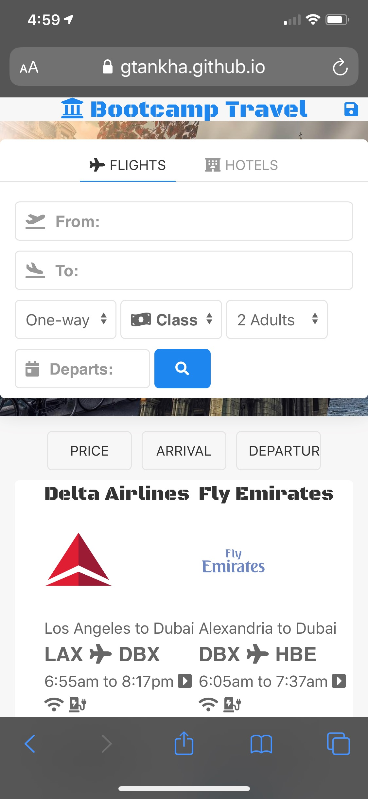
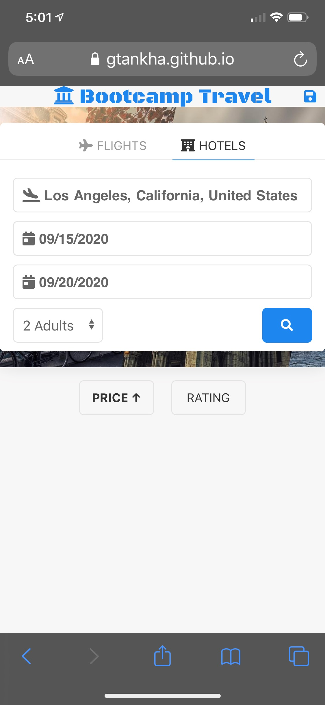

# BootCamp Travel
**Bootcamp Travel** is group 7's project 1 at the University of California, Berkeley, extension, blended-online full-stack web-development part-time bootcamp.

## Purpose of App
- As a frequent traveler...
- I want to be able to:
    - get quick quotes for airfare and lodging costs
    - and save my favorite results
- So that I can:
    - budget for my trip more accurately
    - and access my favorites list in the future

## Collaborators (Group Members)
| Name | GitHub Page | Main Role | Files |
| ---- | ----------- | --------- | ----- |
| Gautam Tankha | https://github.com/gtankha | Project Manager & Hotel search | `hotel.js` |
| Marco Evangelista | https://github.com/marcobjj | User Interface (Structure & Styling) | `index.html`, `style.css`, `script.js`, & `form-select.js` |
| Ahmad El Gamal | https://github.com/ahmadelgamal | Flights search | `flights.js` |

## Technologies Used
1. HTML5
2. CSS3
3. JavaScript
4. JSON
5. AJAX
6. jQuery
7. UI Kit (CSS Framework)

## Project Status
The app is about 90% complete (as of Wednesday September 9th, 2020) and satisfies all the requirements (listed above) as follows:
1. It uses 3 server-side API's, 2 of which return data in JSON format:
    1. Rapid API for hotels (JSON) - 2 different fetch requests are sent to access hotel information: https://hotels4.p.rapidapi.com/locations/search
    2. Amadeus API for flights search (JSON): https://test.api.amadeus.com/v2/shopping/flight-offers
    3. Airhex API for airline carrier logos: https://content.airhex.com/content/logos/airlines
2. It uses UI Kit framework for styling (CSS).
3. It uses localStorage to store the user's favorite search items.
4. It is responsive, designed mobile-first using UI Kit.
5. It meets good coding standards, such as:
    1. HTML and Javascript code has been validated on 3rd party apps.
    2. ESLint was used for indentation, linting, and to verify that code is free from errors that stop it from linting (https://validator.w3.org and http://beautifytools.com/javascript-validator.php).
    3. *camelCase* and relevant terms were used for naming variables and functions.
    4. Scoping has been taken into consideration.
    5. `let` and `const` were often used instead of `var` for memory, hoisting and scoping purposes.
    6. Comments are abundant to divide the code into identifiable sections, and to provide clarity on what the code does.
    7. Git and GitHub were used for version control.
    8. *Issues* and *Projects* were used on GitHub to improve workflow.
6. No alerts, confirms, or prompts were used.
7. It is deployed on GitHub Pages at https://gtankha.github.io/bootcamptravel.
8. It is interactive as such:
    1. For hotels search:
        1. User enters the destination, check-in, check-out dates, and chooses either 1 or 2 adults for hotels search (default is 1).
        2. User can sort hotels search results by price or rating.
        3. User can save a search result item as a favorite. (It is stored in localStorage)
        4. Favorites are stored in localStorage and loaded at revisit & refresh.
    2. For flights search:
        1. User enters departure airport code and date, arrival airport code and return date (for roundtrip flights), travel class (optional) and chooses either 1 or 2 adults for flights search (default is 1).
        2. User can sort flights search results by price, departure time or arrival time.
        3. User can save a search item as a favorite. (It is stored in localStorage)
        4. Favorites are stored in localStorage and loaded at revisit & refresh.

## Challenges & Limitations
1. RapidAPI limits the fetch requests to 5/second and 500/month (for tha basic free account), which is not enough for testing purposes.
2. Amadeus API is a testing API, and it requires an access token that expires every 30 minutes. So we have to renew it every 30 minutes when testing fetch requests.
3. Airhex API put a watermark on the airline logos unless the request is paid. We contacted them and they only offer commercial licenses.
4. Collaborating on GitHub was initially a challenge and we lost a lot of code, but eventually we figured out a better workflow and were able to succeed, thank God.

## Successes
1. Collaboration and teamwork! The group was active on Slack, Zoom and GitHub.
1. Marco gave us a jumpstart by developing the structure (HTML) and styling (CSS) very early on in the project timeline, which made the rest of the work easier to implement.
1. This project was an excellent opportunity to learn how to collaborate on GitHub.

## GitHub Pages Deployment URL
The app is deployed at the following GitHub Pages URL: https://gtankha.github.io/bootcamptravel/

## GitHub Repo URL
https://github.com/gtankha/bootcamptravel/

## How to Use the App
This app is very simple to use. Just follow these steps:
- Fill up the search-form (either hotels or flights)
- Hit enter or click the search button
- You may sort the results as follows:
    - For hotels: by price or ratings
    - For flights: by price, departure time, or arrival time
- Scroll through the list of search results
- Pick your favorite hotel or flight
- Click on the favorite icon to save it to memory (you may choose up to 5 flights and/or 5 hotels)
- Revisit the website at any time to see your favorite items, or make new searches!

## Screenshots:

